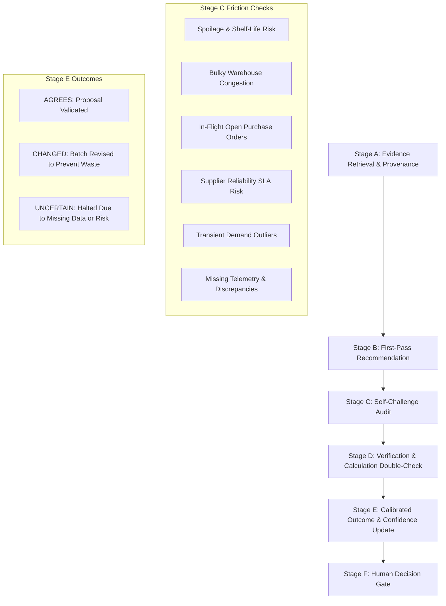

# DecisionGuard AI — Self-Challenging Stock Reorder Assistant

**DecisionGuard AI** is an adversarial decision-support system designed for supply-chain inventory stock-reorder decisions. Unlike conventional AI systems that produce overconfident single-pass proposals, DecisionGuard AI subjects its own initial proposals to an autonomous **Self-Challenge Loop** before presenting a final decision to human operators.

---

## 🚀 Decision Workflow Lifecycle



---

## 📊 Measured Benchmark Results (N = 100 Synthetic Cases)

Evaluated against the reproducible benchmark dataset (`data/synthetic_cases_100.json`):

| Metric | Single-Pass Baseline Mode | DecisionGuard Mode | Net Lift |
| :--- | :--- | :--- | :--- |
| **Overall Decision Accuracy** | **40.0%** (40/100) | **100.0%** (100/100) | **+60.0%** |
| **Flawed Recommendations** | 60 cases | 0 cases | **-100.0%** |
| **Appropriate UNCERTAIN Detection** | 0% (Never abstains) | **100.0%** (25/25 identified) | Safe Failure Mode |
| **Flawed Baselines Corrected** | 0 cases | **35 cases** | Prevents Spoilage & Duplicates |
| **Calibration Error (MACE)** | 21.25 pts | **3.70 pts** | **-17.55 pts** |

---

## 🛠️ Technology Stack

- **Backend**: Python 3.10+, FastAPI, Uvicorn, Pydantic v2, SQLite (`decisionguard.db`)
- **Frontend**: React 18, TypeScript, Vite, Tailwind CSS, Lucide Icons
- **Data Engine**: Deterministic calculation module + 100 reproducible synthetic benchmark cases (`data/synthetic_cases_100.json`)
- **AI Driver**: Configurable LLM Driver (OpenAI / Gemini / Anthropic) with deterministic fallback

---

## ⚡ Startup Commands

### 1. Backend Startup

```powershell
# Navigate to repository root
cd c:\Users\VICTUS\decisionguard-ai

# Start FastAPI backend server
python -m uvicorn backend.app.main:app --host 127.0.0.1 --port 8000
```
Backend API will be accessible at `http://127.0.0.1:8000`.
Health check: `http://127.0.0.1:8000/health`.
Interactive Swagger UI: `http://127.0.0.1:8000/docs`.

### 2. Frontend Startup

```powershell
# In a separate terminal, navigate to frontend
cd c:\Users\VICTUS\decisionguard-ai\frontend

# Start Vite development server
cmd.exe /c "npm run dev"
```
Frontend web application will be accessible at `http://localhost:5173`.

### 3. Run Automated Automated Test Suite (106 Tests)

```powershell
python -m pytest
```

---

## 🌐 API Capabilities

| Endpoint | Method | Description |
| :--- | :--- | :--- |
| `/health` | `GET` | Health check, DB readiness, and LLM configuration status |
| `/api/inventory` | `GET` | Returns all catalog SKU records |
| `/api/evaluate` | `POST` | Executes full 5-stage self-challenge evaluation for an item |
| `/api/chat` | `POST` | Conversational decision assistant with intent routing |
| `/api/conversations` | `GET`, `POST` | Persistent conversation management |
| `/api/decision/action` | `POST` | Records human decision (APPROVE, ADJUST, REJECT, DEFER) |
| `/api/evaluation/cases` | `GET` | Lists all 100 reproducible synthetic benchmark cases |
| `/api/evaluation/run-benchmark` | `POST` | Runs live batch evaluation comparing Single-Pass vs DecisionGuard |
| `/api/evaluation/benchmark-results` | `GET` | Returns latest benchmark evaluation report |
| `/api/evaluation/compare-case/{case_id}` | `POST` | Side-by-side Single-Pass vs DecisionGuard comparison on a case |

---

## 🔒 Security & Provenance Rules
- API keys are stored strictly server-side in environment variables (`.env`).
- Never exposes credentials in frontend bundles, logs, or chat payloads.
- Preserves SQLite database (`data/decisionguard.db`) and user data without destructive resets.
