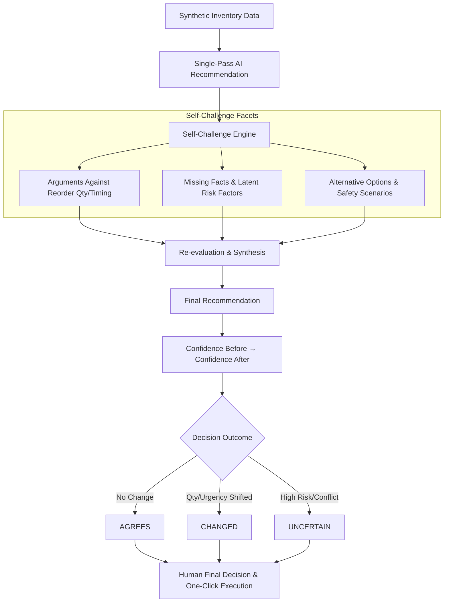

# DecisionGuard AI — Flow Diagram

```mermaid
flowchart TD
    A[Synthetic Inventory Data] --> B[Single-Pass AI Recommendation]
    B --> C[Self-Challenge Engine]
    
    subgraph Self_Challenge [Self-Challenge Facets]
        C1[Arguments Against Reorder Qty/Timing]
        C2[Missing Facts & Latent Risk Factors]
        C3[Alternative Options & Safety Scenarios]
        C --> C1
        C --> C2
        C --> C3
    end
    
    C1 --> D[Re-evaluation & Synthesis]
    C2 --> D
    C3 --> D
    
    D --> E[Final Recommendation]
    E --> F[Confidence Before → Confidence After]
    F --> G{Decision Outcome}
    
    G -->|No Change| H1[AGREES]
    G -->|Qty/Urgency Shifted| H2[CHANGED]
    G -->|High Risk/Conflict| H3[UNCERTAIN]
    
    H1 --> I[Human Final Decision & One-Click Execution]
    H2 --> I
    H3 --> I
```
